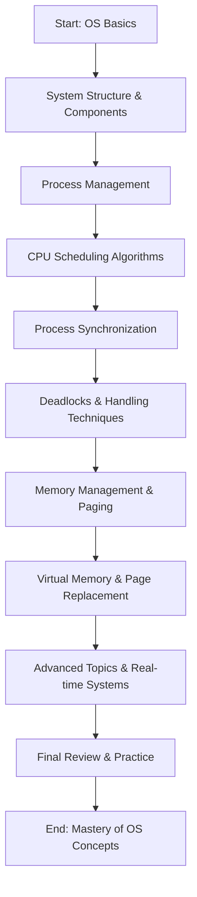

# 📘 Introduction to Operating System – Complete Roadmap (Zero to Advanced)

  
🎥 **Starter Video Resource**: [Introduction to Operating System – Gate Smashers](https://www.youtube.com/watch?v=xw_OuOhjauw&t=162s)

  
📚 **Deep Learning Playlist**: [Operating System – Neso Academy (YouTube Playlist)](https://www.youtube.com/playlist?list=PLBlnK6fEyqRiVhbXDGLXDk_OQAeuVcp2O)

---

## 🎯 Course Objectives
- Understand basic components and functions of an OS.
- Explore CPU scheduling, process management, memory strategies, deadlocks, and system calls.
- Learn practical system design techniques and problem-solving.

---

## 🧠 Course Outcomes
| Code | Outcome |
|------|---------|
| CO1  | Analyze OS structure and system components. |
| CO2  | Understand process lifecycle and management. |
| CO3  | Evaluate and apply CPU scheduling algorithms. |
| CO4  | Understand inter-process communication & synchronization. |
| CO5  | Master deadlock concepts and handling techniques. |
| CO6  | Learn advanced memory allocation and management strategies. |

---

## 📚 Unit-Wise Roadmap

### 🧩 Unit I – Introduction to OS & System Components

#### 🔹 Concepts
- What is an OS? Goals & Roles  
- Computer System Architecture  
- Functions of OS  
- Types of OS (Batch, Multi-tasking, Real-time, etc.)  
- Instruction Cycle, Interrupts, and System Calls  
- Interrupt Handling & Processor Registers  
- I/O Communication Techniques (Polling, Interrupt-driven, DMA)

#### 🔧 Practice
- OS classification exercises  
- Diagram OS structure (kernel/user modes)

---

### ⚙️ Unit II – Process Management & CPU Scheduling

#### 🔹 Concepts
- Process: Definition, Attributes, PCB  
- Process State Models: Two-State, Five-State, Seven-State  
- Process Creation and Termination  
- CPU Scheduling:  
  - Scheduling Criteria  
  - Algorithms: FCFS, SJF, SRTF, RR, Priority, Multilevel, Multilevel Feedback  
  - Multiple Processor Scheduling  
  - Real-Time Scheduling

#### 📊 Numerical Practice
- Calculate average waiting/turnaround times for each algorithm  
- Gantt chart problems

---

### 🔄 Unit III – Process Synchronization

#### 🔹 Concepts
- Race Condition & Critical Section Problem  
- Software Solutions: Peterson’s Algorithm  
- Hardware Solutions: TestAndSet, Swap  
- Synchronization Tools:  
  - Semaphores (Binary & Counting)  
  - Monitors  
  - Classical Problems: Dining Philosophers, Reader-Writer, Producer-Consumer  
- Atomic Transactions & Mutex Locks

#### 🛠️ Hands-On
- Simulate synchronization using C/C++ or pseudocode  
- Trace and analyze semaphore operations

---

### 💣 Unit IV – Deadlocks

#### 🔹 Concepts
- Deadlock System Model  
- Conditions for Deadlock: Mutual Exclusion, Hold & Wait, No Preemption, Circular Wait  
- Resource Allocation Graph  
- Handling Methods:
  - Deadlock Prevention  
  - Deadlock Avoidance: Banker’s Algorithm  
  - Deadlock Detection: Wait-For Graph  
  - Deadlock Recovery

#### 📐 Practice Problems
- Solve Banker’s algorithm step-by-step  
- Draw and analyze resource allocation graphs

---

### 🧠 Unit V – Memory Management Strategies

#### 🔹 Concepts
- Memory Hierarchy: Registers, Cache, Main Memory  
- Swapping, Loading, Linking, Protection  
- Allocation:  
  - Fixed & Dynamic Partitioning  
  - Paging, Segmentation, Segmentation with Paging  
- Virtual Memory:  
  - Demand Paging  
  - Page Fault Handling  
  - Page Replacement Algorithms (FIFO, LRU, Optimal, LFU, MFU)

#### 📘 Key Formulas
- Effective Access Time  
- Page Fault Rate

#### 🧪 Hands-On
- Solve memory allocation scenarios  
- Compare performance of page replacement algorithms

---

## 📖 Recommended Books

### 📗 Primary Textbooks
- *Operating System Concepts* – Silberschatz, Galvin, Gagne (8e)  
- *Operating Systems: Internals and Design Principles* – William Stallings (7e)

### 📘 Reference Books
- *Modern Operating Systems* – Andrew Tanenbaum (4e)  
- *Design of the UNIX Operating System* – Maurice Bach  
- *Operating Systems: Three Easy Pieces* – Remzi H. Arpaci-Dusseau

---

## 🔁 Learning Flow Summary

---