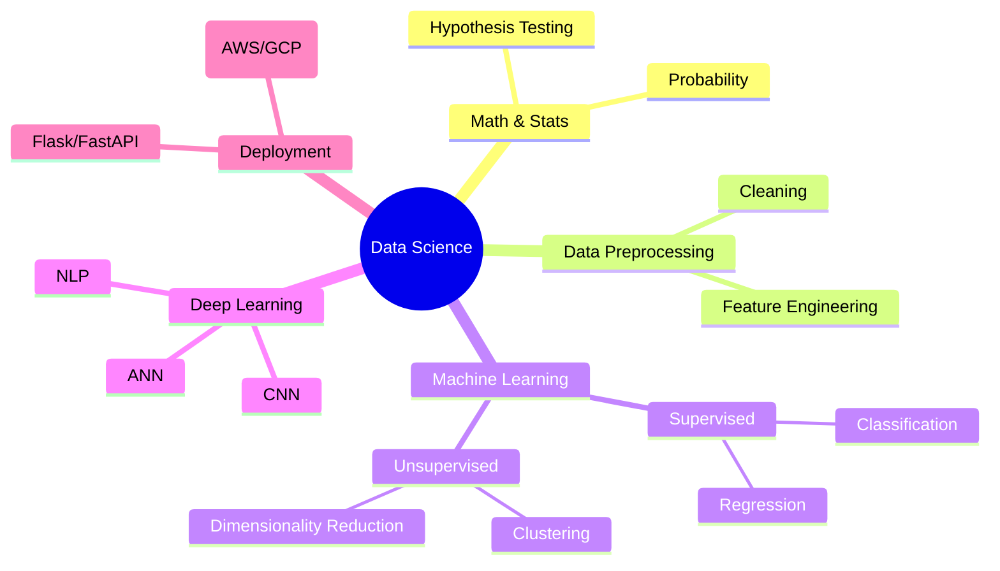

# **Complete Data Science Mastery Guide: From Zero to Expert (2025 Edition)**  
*(Based on the 27-hour YouTube Course: [Data Science FULL Course for Beginners in 27 HOURS - 2025 Edition](https://www.youtube.com/watch?v=gDZ6czwuQ18))*

---

## **📌 Learning Roadmap & Mind Map**  
*(Structured from Beginner to Advanced)*  

### **🔹 Phase 1: Foundations of Data Science (Math & Statistics)**
📌 **Topics Covered:**  
✅ **Introduction to Statistics**  
   - Population vs Sample  
   - Descriptive vs Inferential Statistics  
   - Basic Statistical Measures (Mean, Median, Mode, Variance, Std. Deviation)  

✅ **Probability & Distributions**  
   - Probability Basics  
   - Probability Distributions (Binomial, Poisson, Normal)  
   - Central Limit Theorem  

✅ **Advanced Statistics**  
   - Covariance & Correlation  
   - Hypothesis Testing (Z-test, T-test, Chi-square, ANOVA)  
   - Confidence Intervals  

📌 **Resources:**  
- Khan Academy (Statistics & Probability)  
- *"Practical Statistics for Data Scientists"* (Book)  

---

### **🔹 Phase 2: Data Preprocessing & Feature Engineering**  
📌 **Topics Covered:**  
✅ **Data Cleaning**  
   - Missing Value Handling (Mean/Median Imputation, KNN Imputation)  
   - Outlier Detection (IQR, Z-score, DBSCAN)  
   - Handling Duplicates  

✅ **Feature Encoding**  
   - One-Hot Encoding  
   - Label Encoding  
   - Ordinal Encoding  

✅ **Feature Scaling**  
   - Standardization (Z-score Normalization)  
   - Min-Max Normalization  

✅ **Feature Selection**  
   - Backward Elimination  
   - Forward Selection  
   - Correlation-based Feature Selection  

📌 **Tools:**  
- Pandas, Scikit-learn (`SimpleImputer`, `StandardScaler`)  

---

### **🔹 Phase 3: Machine Learning (Supervised & Unsupervised)**  
📌 **Supervised Learning**  
✅ **Regression**  
   - Linear Regression  
   - Polynomial Regression  
   - Regularization (Ridge, Lasso)  

✅ **Classification**  
   - Logistic Regression  
   - Decision Trees  
   - Random Forest  
   - SVM (Support Vector Machines)  
   - Naive Bayes  

📌 **Unsupervised Learning**  
✅ **Clustering**  
   - K-Means  
   - Hierarchical Clustering  
   - DBSCAN  

✅ **Association Rule Learning**  
   - Apriori Algorithm  
   - FP-Growth  

📌 **Model Evaluation**  
- Confusion Matrix, Precision, Recall, F1-Score  
- ROC-AUC Curve  
- Silhouette Score (Clustering)  

📌 **Hyperparameter Tuning**  
- GridSearchCV, RandomizedSearchCV  
- Cross-Validation (K-Fold)  

---

### **🔹 Phase 4: Ensemble Learning & Advanced ML**  
📌 **Ensemble Methods**  
✅ **Bagging** (Random Forest)  
✅ **Boosting** (XGBoost, LightGBM, CatBoost)  
✅ **Stacking & Voting Classifiers**  

📌 **Dimensionality Reduction**  
- PCA (Principal Component Analysis)  
- t-SNE  

---

### **🔹 Phase 5: Deep Learning & AI**  
📌 **Neural Networks Basics**  
- Perceptrons  
- Activation Functions (ReLU, Sigmoid, Tanh)  
- Loss Functions (Cross-Entropy, MSE)  

📌 **Deep Learning Architectures**  
- **ANN** (Artificial Neural Networks)  
- **CNN** (Convolutional Neural Networks)  
- **RNN & LSTM** (Recurrent Networks)  
- **Transformers** (BERT, GPT Basics)  

📌 **Training Process**  
- Forward & Backpropagation  
- Optimizers (SGD, Adam, RMSprop)  
- Batch Normalization  

📌 **Applications**  
- Computer Vision (OpenCV, YOLO)  
- NLP (Text Classification, Sentiment Analysis)  

---

## **📌 Learning Flow (Step-by-Step)**  
1️⃣ **Math & Stats** → 2️⃣ **Python & SQL** → 3️⃣ **Data Cleaning & EDA** → 4️⃣ **ML Algorithms** → 5️⃣ **Ensemble & DL** → 6️⃣ **Real-World Projects**  

---

## **📌 Mind Map (Visual Overview)**  

---

## **📌 Final Tips for Mastery**  
✔ **Work on Projects** (Kaggle, Personal Datasets)  
✔ **Learn SQL & Big Data Tools** (Spark, Hadoop)  
✔ **Stay Updated** (Follow ArXiv, Towards Data Science)  
✔ **Join Communities** (Kaggle, Reddit r/datascience)  

---

### **🔗 Start Now & Keep Learning!**  

  

Would you like a **personalized study plan** based on your background? Let me know! 🚀