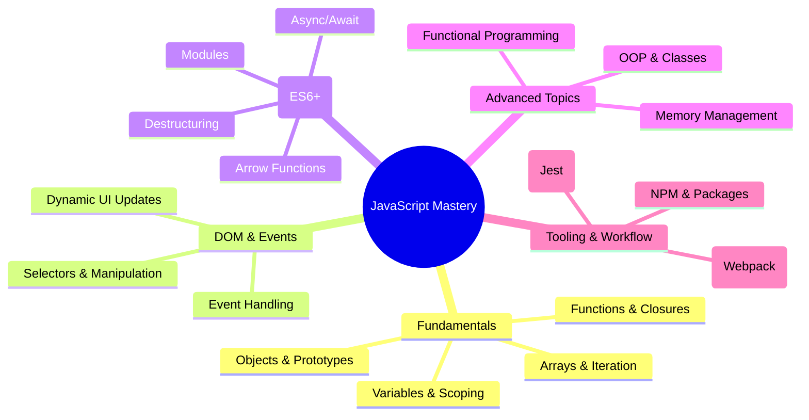

# **Complete JavaScript Mastery Roadmap: From Zero to Expert (2024 Edition)**

## **🚀 Learning Path Overview**
This roadmap is designed to take you from a complete beginner to a JavaScript expert through structured modules, hands-on projects, and deep dives into advanced concepts.

### **📌 Key Objectives**
- Master **JavaScript fundamentals** and **modern ES6+ syntax**
- Understand **how JavaScript works** behind the scenes
- Build **real-world projects** for your portfolio
- Learn **asynchronous JS, OOP, functional programming, and DOM manipulation**
- Prepare for **job interviews** and **advanced frameworks (React, Vue, Node.js)**

---

## **📚 Step-by-Step Learning Flow**

### **1️⃣ Phase 1: JavaScript Fundamentals (Weeks 1-2)**
**Goal:** Understand core concepts, syntax, and basic programming logic.

#### **Topics Covered:**
- **Variables & Data Types** (`let`, `const`, `var`, primitives vs. objects)
- **Operators & Expressions** (arithmetic, comparison, logical)
- **Control Structures** (`if/else`, `switch`, ternary operator)
- **Loops** (`for`, `while`, `do...while`, `break/continue`)
- **Functions** (declarations, expressions, arrow functions)
- **Arrays & Objects** (methods, destructuring, spread/rest)
- **Strings & Template Literals**
- **Type Conversion & Coercion**
- **Truthy & Falsy Values**
- **Debugging & Developer Tools**

#### **📌 Exercises & Challenges:**
- **50+ coding exercises** (Udemy-style challenges)
- **Mini-projects:**  
  - **Simple Calculator**  
  - **To-Do List (Console Version)**  
  - **Number Guessing Game**

---

### **2️⃣ Phase 2: Deep Dive into JavaScript (Weeks 3-4)**
**Goal:** Master advanced JS concepts and how JavaScript works under the hood.

#### **Topics Covered:**
- **Execution Context & Call Stack**
- **Scope & Hoisting** (lexical scope, block scope, TDZ)
- **The `this` Keyword** (implicit, explicit, `bind/call/apply`)
- **Closures & Higher-Order Functions**
- **IIFE (Immediately Invoked Function Expressions)**
- **Prototypal Inheritance & OOP**
- **ES6 Classes & Modules**
- **Error Handling (`try/catch`)**
- **Memory Management (Heap, Stack, Garbage Collection)**

#### **📌 Exercises & Challenges:**
- **Closure-based counter**
- **Custom array methods (map, filter, reduce from scratch)**
- **OOP-based "Bank Account" simulation**

---

### **3️⃣ Phase 3: DOM Manipulation & Events (Weeks 5-6)**
**Goal:** Build interactive web apps by mastering the DOM.

#### **Topics Covered:**
- **DOM Tree & Selecting Elements** (`querySelector`, `getElementById`)
- **Manipulating Styles & Classes**
- **Handling Events** (click, submit, keyboard, mouse)
- **Event Propagation (Bubbling & Capturing)**
- **Event Delegation**
- **Dynamic Element Creation & Removal**
- **Working with Forms & Inputs**
- **Intersection Observer API (Lazy Loading)**
- **Timers (`setTimeout`, `setInterval`)**

#### **📌 Projects:**
- **Modal Window Component**
- **Tabbed Navigation**
- **Image Slider**
- **Sticky Navigation Bar**

---

### **4️⃣ Phase 4: Modern JavaScript (ES6+) & Tooling (Weeks 7-8)**
**Goal:** Use modern JS features and developer tools efficiently.

#### **Topics Covered:**
- **Destructuring (Arrays & Objects)**
- **Spread/Rest Operators**
- **Optional Chaining (`?.`) & Nullish Coalescing (`??`)**
- **Promises & Async/Await**
- **Fetch API & AJAX Calls**
- **Modules (ES6 Import/Export)**
- **NPM & Package Management**
- **Bundlers (Parcel, Webpack)**
- **Babel & Transpiling**
- **Debugging with Chrome DevTools**

#### **📌 Projects:**
- **Weather App (API Fetching)**
- **Recipe Finder (Async/Await + API)**
- **Custom NPM Package (Simple Utility Library)**

---

### **5️⃣ Phase 5: Advanced JavaScript & Real-World Apps (Weeks 9-12)**
**Goal:** Build complex apps with architecture patterns.

#### **Topics Covered:**
- **Functional Programming (Pure Functions, Immutability)**
- **Design Patterns (MVC, Pub/Sub, Singleton)**
- **LocalStorage & State Management**
- **Web Workers (Parallel Processing)**
- **WebSockets (Real-Time Apps)**
- **Unit Testing (Jest)**
- **Performance Optimization**
- **Security Best Practices (XSS, CSRF)**

#### **📌 Projects:**
- **E-Commerce Cart (OOP + LocalStorage)**
- **Real-Time Chat App (WebSockets)**
- **Bankist App (Full MVC Architecture)**
- **Portfolio Project (Custom API Integration)**

---

## **🎯 Final Steps to Expertise**
- **Contribute to Open Source**
- **Master a JS Framework (React, Vue, Angular, or Svelte)**
- **Learn Node.js for Backend Development**
- **Prepare for Technical Interviews (Algorithms, System Design)**

---
## **📺 Recommended Videos**  
#### **Click the thumbnails to watch!** 
<table>
    <tr>
        <td>
            <a href="https://www.youtube.com/watch?v=o68WJE3V_pw" target="_blank">
                 
            </a>
        </td>
        <td>
            <a href="https://www.youtube.com/watch?v=TvUAyHEMJX4" target="_blank">
                 
            </a>
        </td>
    </tr>
</table>
---

## **🧠 JavaScript Mind Map (Key Concepts)**

---

## **📅 6-Month Roadmap to Mastery**
| **Month** | **Focus Area** | **Projects** |
|-----------|----------------|--------------|
| **Month 1** | Fundamentals & Syntax | Calculator, To-Do List |
| **Month 2** | DOM & Events | Modal, Slider, Tabbed UI |
| **Month 3** | Async JS & APIs | Weather App, Recipe Finder |
| **Month 4** | OOP & Design Patterns | Bankist App, E-Commerce Cart |
| **Month 5** | Advanced Topics | Real-Time Chat, Open Source Contributions |
| **Month 6** | Job Prep & Frameworks | React/Vue Portfolio Project |

---

## **🎁 Bonus Resources**
- **Free Books:**  
  - [Eloquent JavaScript](https://eloquentjavascript.net/)  
  - [You Don’t Know JS (YDKJS)](https://github.com/getify/You-Dont-Know-JS)  
- **Interactive Learning:**  
  - [JavaScript30 (30 Projects)](https://javascript30.com/)  
  - [Codewars (Coding Challenges)](https://www.codewars.com/)  
- **YouTube Channels:**  
  - Fireship  
  - The Net Ninja  
  - Traversy Media  

---

## **🚀 Final Advice**
- **Code daily** (even 30 minutes helps!)  
- **Build projects** (theory alone won’t make you an expert)  
- **Read MDN Docs** (best JS reference)  
- **Join communities** (Stack Overflow, Discord, Reddit)  

**Ready to become a JavaScript expert? Start today!** 🚀🔥  

Would you like a **personalized study plan** based on your goals? Let me know! 😊